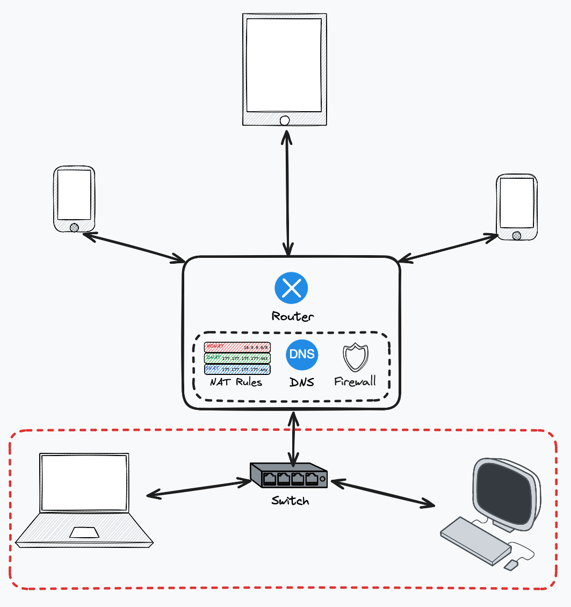
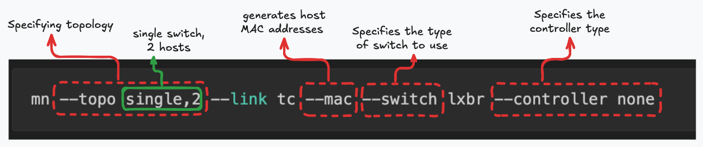
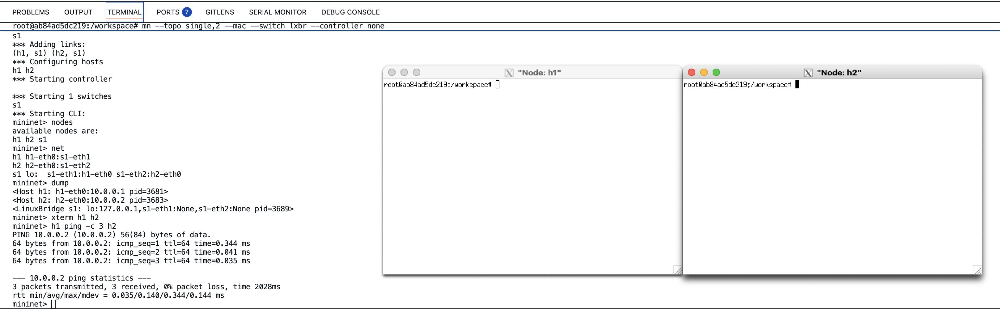
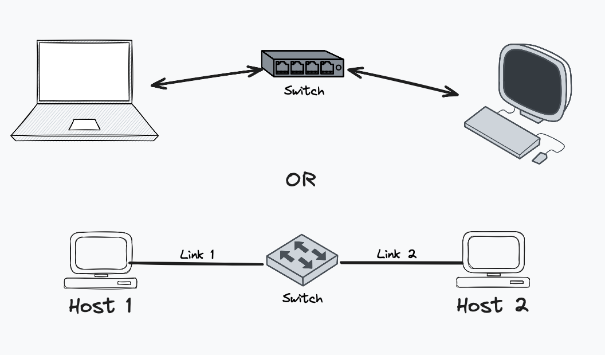
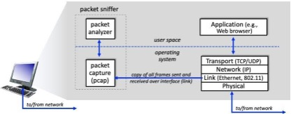
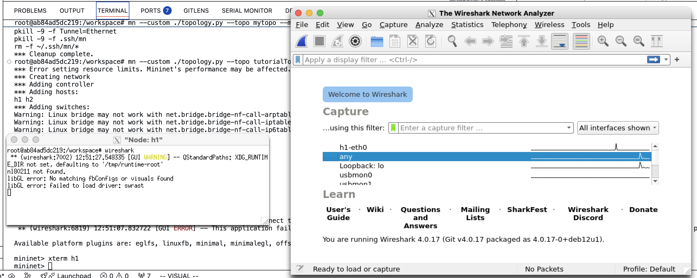
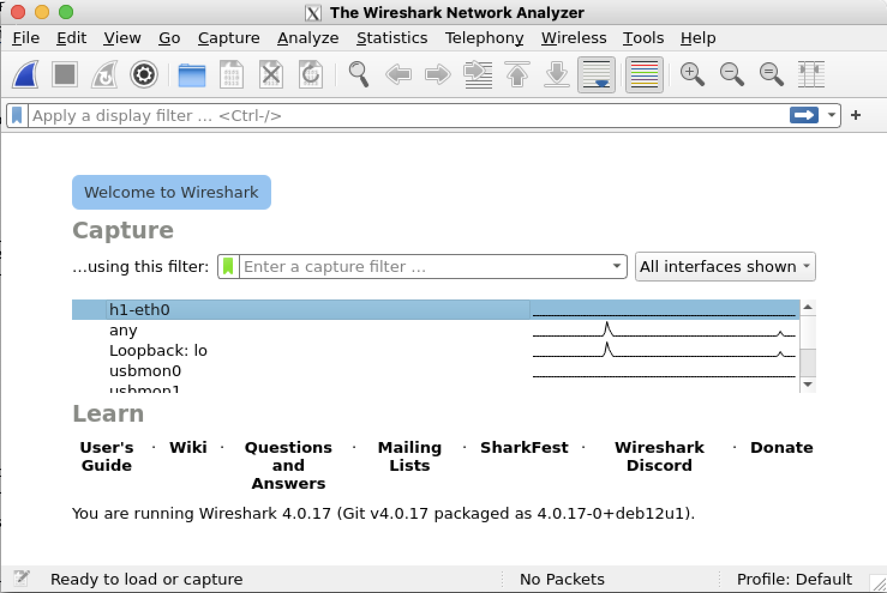
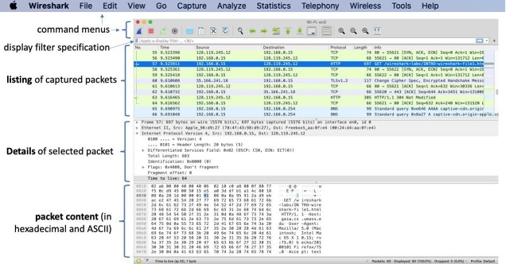

# Introduction to Advanced Networking


In this lab activity, we will explore the different elements that make up a modern computer network and guide you through building and configuring your very own network. By using a simple scenario of a home network, we will dissect the different protocols and functionalities that connect your network devices to the Internet and understand how they interoperate to provide connectivity.

## Lab Overview

In this lab activity, we will explore the different elements that make up a modern computer network and guide you through building and configuring your very own network.

Think about your home network: you’ve got a Wi-Fi modem or router that connects your laptop, phone, TV, and maybe even your fridge (because why not) to the Internet ([Figure 1](#home-topo)). This appears to be a very simple network scenario, but it implements several key functionalities essential in delivering connectivity in the highly distributed and complex global Internet. 

{width="2in"}
<!-- [home-topo]: home-topo.png "Typical Home Network Topology" -->

Have you ever wondered:

- How does your modem know which data belongs to which device?
- How does it forward your Netflix traffic to the internet while sending a Zoom call to your laptop at the same time?
- What magic is happening inside that little plastic box with too many blinking lights?
    
**Well… quite a lot!** Your Wi-Fi modem is doing multiple jobs at once, such as:

- *Routing*: deciding where packets should go
- *Switching*: connecting devices inside your home network
- *Network Address Translation (NAT)*: letting many devices share one public IP
- *DNS Forwarding*: helping translate website names into IP addresses
- *Firewalling*: keeping unwanted traffic out
  
This lab activity will help you to recreate these functionalities in a lab machine/VM using a network emulator, understand how these components work and even configure some of them yourself. For this activity, we will emulate a home network scenario, connecting to a small set of Internet services. This will remind you how different protocols are used to connect devices to the global Internet and get you up to speed with some of the key technologies we will use this year to explore advance network topics in the module labs.

By the end of this lab activity, you will be able to:

- [ ] Understand the key components of a home network and their functions
- [ ] Use Mininet to create and experiment with virtual network topologies
- [ ] Capture and analyze network traffic using Wireshark
- [ ] Refresh you knowledge on network protocols and packet structures

### Lab tools

During our labs we will use a combination of tools designed for recreating, visualising and experimenting with networks:

- [Mininet](https://mininet.org/) is a network emulator that creates a realistic virtual network on a single machine. It uses lightweight virtualization to run multiple hosts, switches, and links, all within a single Linux host. We will use Mininet to recreate virtual network topologies with real Linux hosts, switches, and links. Mininet is ideal for reproducible network testing and experimentation, using common virtualisation technologies available in the Linux kenrel. 
- [P4](https://p4.org/) is the latest generation of open Software Defined Network technologies. It is a protocol-independent language for programming how packets are processed by a network device. With P4, you can define custom behaviours inside routers and switches, while network vendors, like Intel and Barefoot, provide hardware that can run P4 programs at line rate (Tbps data processing rates). We will explore this technology in more detail in the Week 12 lecture and labs.
- [Wireshark](https://www.wireshark.org/) is a network protocol analyzer that lets you capture and inspect packets in real-time. It provides a graphical interface to view packet details, filter traffic, and analyze network protocols. We will use Wireshark to observe and analyze the traffic flowing through our emulated networks and understand how protocols work under the hood.
- [Python](https://www.python.org/) will be used to script Mininet topologies and to implement custom P4 control logic. You should be familiar with basic Python programming concepts, from modules like SCC.231.  We will use Python scripts to automate network configurations and experiments. If you want to refresh your Python skills, consider checking out resources like [Future Coder](https://futurecoder.io/).

## Task 0: Opening the Dev Container

Working with network protocols on a host, requires a lot of configuration and tweak ing of the host operating system. We also need to run code as root, which is a major security threat and requires careful handling. To make your life easier, we use a technologies called containers, to package everything you need to run our lab activities in a pre-configured environment. You might have heard of Docker containers, which are lightweight, portable, and consistent virtual instances that can run applications and services.

In order to open the code in a devcontainer, you should select the options `Open In devcontainer` when opening the folder in VSCode. If you missed the option when openning the project, you can still setup the devcontainer. Use the key combination of Ctrl+Shift+P to open the command palette and then select **Dev Containers: Open Folder in Container...**. Both options are depicted in the screenshots below.

{width="5in"}

{width="5in"}

If you have opened correctly the devcontainer, you should see the following prompt when opening a new terminal in VSCode:

{width="5in"}

## Understanding the Functionality of a Home Wi-Fi Modem

As mentioned, a home network consists of multiple separate components that perform different functions. Most home networks follow a star topology, where multiple devices connect to a central Wi-Fi modem — just like the one shown in [Figure 1](#home-topo).

Although it looks simple from the outside, your home router is quietly multitasking, like a networking superhero. It:

- Manages wireless connections
- Acts as a Layer 2 switch for wired devices
- Performs routing between your home network (LAN) and the internet (WAN)
- Runs NAT so all your devices can share one public IP
- Handles DNS forwarding
- Implements firewall rules to protect your network

Understanding these functions gives you a strong foundation before we jump into designing and customizing networks using Mininet and P4.

To gain deeper insight into how each of these components works, we will disaggregate the Wi-Fi modem and examine each function individually. [Figure 2](#home-dis-topo) illustrates the different components and shows how they would be positioned in the network topology once separated.

{width="5in"}
<!-- [home-dis-topo]: home-dis-topo.png "Disaggregated Home Network Topology" -->

Before we discuss how to use Mininet, let's first remind our selves the concept of layering in computer networks. Computer network technologies, in order to manage complexity and scalablity, adopt layering and abstraction as a mechanism to separate different functionalities into **layers**. Each layer is responsible for specific tasks, it provides services to the layer above and it relies on the services of the layer below it. This separation allows for easier design, implementation, and troubleshooting of network protocols and devices.

The TCP/IP model, the main Internet protocol stack, considers five networks layers:

1. *Physical Layer*: This layer deals with the physical transmission of data over a medium, such as cables or wireless signals. It defines the electrical and mechanical aspects of data transmission (e.g. how do you represent a single bit using an electric current).
2. *Data Link Layer*: This layer is responsible for node-to-node data transfer and error detection/correction. The functionalities include framing, forwarding and addressing (using MAC addresses). The data link layer ensures that two nodes on the same network can communicate effectively and Ethernet is a common protocol used at this layer.
3. *Network Layer*: This layer handles the routing of data packets across different networks. It determines the best path for data to travel from the source to the destination. It uses logical addressing (IP addresses) to identify devices on the network and protocols like IP (Internet Protocol) operate at this layer. 
4. *Transport Layer*: This layer provides end-to-end communication control, ensuring complete data transfer. It manages error recovery, flow control, and segmentation of data. The transport layer only works between two end systems (hosts) and does not involve intermediate devices like routers or switches. Common protocols at this layer include TCP (Transmission Control Protocol) and UDP (User Datagram Protocol).
5. *Application Layer*: This layer provides network services directly to user applications. It includes protocols for email, file transfer, and other network software services.

We will begin by exploring Mininet by creating a simple topology with a single switch and using it to understand how a switch operates.

## Task 1: Working with Mininet

<!-- How to use mininet -->
> **NOTE**: Run the command `xhost +` in a terminal on your lab machine (i.e., *not* in the devcontainer or a host in the mininet topology, a terminal on the actual lab machine) before starting Wireshark or xterm in the devcontainer. This command allows GUI applications running inside the devcontainer to be displayed on your host machine.

Mininet is a powerful network emulator that allows you to create and test virtual network topologies on a single machine. It uses lightweight virtualization to run multiple hosts, switches, and links, all within a single Linux host. This makes it an ideal tool for learning about networking concepts, testing network applications, and experimenting with network protocols. Each host behaves like a real machine, capable of realisticallt running network programs (web servers, ping, iperf, SSH), and having its own network addresses and interfaces.

### How Do We Use Mininet to Reproduce the Functionality of a Switch?

In this part of the lab activity, we will focus on the highlighted component of the home Wi-Fi modem topology discussed earlier — the switch — as shown in [Figure 6](#home-topo-highlight).  With mininet, we can reproduce this in two ways, using the command line or using python scripts. We will explore both one by one.  Mininet allows us to recreate real network behaviour in software, making it the perfect tool for experimenting without needing physical hardware. Using Mininet, we can build a simple network where multiple hosts are connected to a switch and observe how packets are forwarded between them.

There are two main ways to create this topology in Mininet:

- Using the Mininet Command Line Interface (CLI)
  - Quick and easy
  - Limited set of topologies
  - Great for learning, testing, and experimenting
- Using Python Scripts
  - More flexible and powerful
  - Allows automation and repeatable experiments
  - Commonly used for larger or more complex topologies

{width="5in"}


We will explore both approaches step by step, starting with the command line and then moving on to Python scripting. This will help you understand not only how a switch works, but also how Mininet represents and manages network devices behind the scenes.
By the end of this section, you’ll be comfortable creating a basic switch-based topology and observing how data flows through it — just like in a real network.

### Mininet CLI

Lets load using Mininet a simple topology on our devcontainer environment consisting of two hosts connected to a single switch. Open a terminal in the devcontainer and run the following command in the VSCode terminal. The command executes Mininet, creates the topology and give you access to the Mininet terminal from which you can run multiple commands.

```bash
mn --topo single,2 --link tc --mac --switch lxbr --controller none --arp
```


Once the topology is created, you should see the Mininet prompt:

```bash
mininet >
```

You can enter commands at this prompt to interact with the Mininet environment. The Mininet prompt offers a few simple commands to inspect the topology of your experiment. Try to run the following commands to inspect the network:

```
mininet> nodes
mininet> net
mininet> dump
```

The `nodes` command lists all the nodes (hosts and switches) in the topology. The `net` command shows the connections between the nodes, and the `dump` command provides detailed information about each node, including its IP address and MAC address.

You can also run commands on individual hosts by prefixing the command with the host name. For example, to test connectivity between the two hosts, you can use the `ping` command:

```
mininet> h1 ping -c 3 h2
```

The previous command will execute the program ping on host h1, send 3 ICMP echo requests to host `h2` and display the round-trip time (RTT) for each packet.

```
mininet > xterm h1 h2
```

{width="6in"}

Each host in the network will have a set of network interfaces and a network configuration, in the form of unique IP and MAC addresses, on each interface. A network interface is important for a host to connect to the network. In our example, host `h1` will have single interface (`h1-eth0`) You can also inspect the interfaces of each host, using the built-in Linux network configuration tools. For example, you can use the iproute2 tool called `ip`. The program allows to inspect the addresses assigned to each interface (`ip addr show`), the IP routes (`ip route show`) and the interfaces (`ip dev show`). By running the commands `h1 ip addr show` and `h2 ip addr show`, you should see that each host has a single interface (eth0) with a unique IP address. You can also run the command `ip addr show`, in the xterm terminal you create in the previous step on each host.

> **TODO**: Using now the created topology, answer the questions in the [Week1 Unassessed Quiz](https://modules.lancaster.ac.uk/mod/quiz/view.php?id=2824281).

### Automation: Switch Topologies with Python

Mininet offers a Python API to create topologies. The lab template provides you with a very basic topology file (`./topology.py`) that, through Mininet, will produce an emulated network consisting of 2 host connected via two seperate links to a switch ([Figure 8](#topology)). But what exactly does all that mean?



<!--  -->

There are 3 fundamental components to a Mininet topology: *Hosts*, *Switches* and *Links*. In later stages we will discuss additional custom components, such as routers, but for now we will focus on these 3.

The topology in the lab template code defines a custom class that extends the `Topo` class in Mininet. This class contains the logic to create the nodes and links that make up the topology. The documentation for the `Topo` class can be found [here](http://mininet.org/api/classmininet_1_1topo_1_1Topo.html), and it allows to add each of these components via the `addHost`, `addSwitch` and `addLink` methods. We will discuss these methods in more detail in Stage 4 and we will use them to implement custom topologies.


| **Method**                      | **Description**                                                           |
| ------------------------------- | ------------------------------------------------------------------------- |
| `addHost(name, ip=None, default=None, **opts)`         | Adds a host to the topology with the given name. You can optionally set an IP address for the first interface, define a default route for the host, as well as control other options.              |
| `addSwitch(name, **opts)`       | Adds a switch to the topology with the given name and options. Mininet offers a range of different switch types, such as Open vSwitch, Linux Bridge, and user-space switches, which can be specified through options. For this lab we will use the Linux Bridge switch (`lxbr`) and we will replace the switch class with a P4 switch in later activities.           |
| `addLink(node1, node2, intf1=None, intf2=None, params1=None, params2=None, **opts)` | Adds a link between two nodes (hosts or switches) with the given options. |
|                                 |

As you might have guessed, the provided topology file generates the same topology as the one created by the command `mn --topo single,2 --mac --switch lxbr --controller none`. To run the provided topology, execute the following command in a terminal:

```bash
mn --custom ./topology.py --link tc --topo tutorialTopology --mac --switch lxbr --controller none --arp
```

This command tells Mininet to use the custom topology defined in `topology.py` and to create a network with the specified parameters. Once the topology is created, you should see the Mininet prompt again. You can use the same commands as before to inspect the network and test connectivity between the hosts.

### Questions 


## Task 2: Testing the functionality of a switch in Mininet

### Introduction to Ethernet and Ethernet Switches

Ethernet is the most widely used technology for local area networks (LANs). It defines a set of standards for wiring and signaling at the physical layer, as well as data link layer protocols for framing and addressing. Ethernet uses MAC (Media Access Control) addresses to uniquely identify devices on a network. The Ethernet header is the first part of every network packet and contains important information for delivering the packet to its destination within a local network. It typically contains an address of the sender and the receiver of the packet, as well as a type field that indicates the protocol of the payload (e.g., IPv4, IPv6, ARP).

In order to connect multiple devices within a local network, Ethernet requires specisal devices that can multiplex traffic between several cables. Originally, network hubs were the first attempt to achieve this. Hubs rebroadcast traffic received on a Ethernet cable, to all cables connected to the devive. Because hubs blindly reatrnsmit traffic, they are inefficient and insecure as they blindly broadcasted incoming packets to all connected devices. To improve efficiency and performance, Ethernet switches were introduced. Instead of blindly broadcasting data to every device, a switch uses an algorithm to learn the MAC addresses of devices connected to each port. It reads MAC addresses and forwards packets only to the correct destination, improving speed and efficiency.

#### 📨 Analogy: The Office Mailroom

Think of a switch like an office mailroom:

- Every employee has a desk number (MAC address)
- The mailroom reads the desk number on each envelope
- Mail is delivered only to the correct desk, not to everyone

This is exactly how a switch ensures packets reach the right device.


### Verifying Switch Functionality with Wireshark

In order to make sure that our switch is working properly, we need to make sure that our hosts can communicate with each other. In the previous task, we used two different ways to bring up a small part of the home network topology. in this task, we will establish and ensure connectivity between those components. This can be done by examining the traffic between the two hosts.

We can observe the sequence of messages exchanged between two protocol entities, delve down into the details of protocol operation, and cause protocols to perform certain actions and then observe these actions and their consequences. For this stage, we will use the popular network protocol analyzer Wireshark to capture and interactively browse the traffic running on a computer network.

In computer networks, a packet serves as a fundamental unit of data that facilitates communication between devices. In the next section, we will leartn about packets.

## What is a packet?

You can imagine a packet as a small, self-contained parcel carrying information across the vast landscape of the Internet.

Unlike traditional methods where a continuous stream of data is transmitted, the Internet relies on a concept known as packet switching. In this paradigm, large volumes of data are broken down into manageable pieces or "packets" before being sent across the network. Each packet, akin to an organised postcard, contains the actual data and essential information such as the source and destination addresses (i.e., IP addresses).

As these packets traverse the network, they follow diverse routes to reach their destination. This dynamic approach enhances efficiency and robustness, as multiple packets can travel concurrently without relying on a fixed path. Upon reaching their destination, the packets are reassembled, reconstructing the original message or data.

## How can you view incoming and outgoing packets on your computer?

A **packet sniffer** is the basic tool for observing incoming and outgoing packets. As the name suggests, a packet sniffer captures ("sniffs") messages being sent and received from or by your computer; it will also typically store and display the contents of the various protocol fields in these captured messages. A packet sniffer is passive: it observes messages being sent and received by applications and protocols running on your computer but never sends packets.  Similarly, received packets are never explicitly addressed to the packet sniffer. Instead, a packet sniffer gets a *copy* of packets sent or received from/by application and protocols executing on your machine.

Figure 8 shows the structure of a packet sniffer. At the right of Figure 8 are the protocols (in this case, Internet protocols) and applications (such as a web browser or email client) that usually run on your computer. The packet sniffer, shown within the dashed rectangle in Figure 8, is an addition to the usual software in your computer and consists of two parts:

{width="4.325937226596675in"
height="1.703124453193351in"}

* The **packet capture library** receives a copy of every packet that is sent from or received by your computer over a given interface (e.g., Ethernet card or Wi-Fi). As discussed above, messages exchanged by protocols such as HTTP (to be covered on Thursday of Week 12) are eventually encapsulated in packets that are transmitted over physical media such as an Ethernet cable or a Wi-Fi radio. Capturing the packets thus gives you all the messages sent/received from/by all the applications executing on your computer.

* The second component of a packet sniffer is the **packet analyser**, which displays the contents of all fields within a protocol message.  To do so, the packet analyser must "understand" the structure of all messages exchanged by protocols. For example, suppose we are interested in displaying the various fields in messages exchanged by the HTTP protocol in Figure 1. The packet analyser understands the format of Ethernet frames and can identify the IP datagram within an Ethernet frame. It also understands the IP datagram format, so that it can extract the TCP segment within the IP datagram.

Finally, it understands the TCP segment structure, so it can extract the HTTP message contained in the TCP segment. Finally, it understands the HTTP protocol and so, for example, knows that the first bytes of an HTTP message will contain the string "GET," "POST," or "HEAD," as shown later in Figure 5 below.

In 333 labs, we will use the [Wireshark packet sniffer](http://www.wireshark.org/) for these labs, allowing us to display the contents of messages being sent/received from/by protocols at different levels of the protocol stack. (Technically speaking, Wireshark is a packet analyser that uses a packet capture library on your computer).

Also, technically speaking, Wireshark captures link-layer frames as shown in Figure 1, but uses the generic term "packet" to refer to link-layer frames, network-layer datagrams, transport-layer segments, and application-layer messages, so we'll use the less-precise "packet" term here to go along with Wireshark convention). Wireshark is a free network protocol analyser that runs on Windows, Mac, and Linux/Unix computers. It's an ideal packet analyser for our labs -- it is stable, has a large user base and well-documented support that includes:

* a [user guide](http://www.wireshark.org/docs/wsug_html_chunked/)
* a [man pages](http://www.wireshark.org/docs/man-pages/)
* a [detailedFAQ](http://www.wireshark.org/faq.html)
* Rich functionality that includes the capability to analyze hundreds of protocols, and a well-designed user interface. 
  
It operates in computers using Ethernet, serial (PPP), 802.11 (WiFi) wireless LANs, and many other link-layer technologies.

### Part 0: Running Wireshark

> **NOTE**: Run the command `xhost +` in a terminal on your lab machine (i.e., *not* in the devcontainer or a host in the mininet topology, a terminal on the actual lab machine) before starting Wireshark or xterm in the devcontainer. This command allows GUI applications running inside the devcontainer to be displayed on your host machine.

You can start Wireshark on a the node h1 of your topology by open an xterm (i.e., `> xterm h1`) and then entering the command `wireshark` in the terminal.

{width="3.158688757655293in"
height="2.0781244531933507in"}

When you run the Wireshark program, you'll get a startup screen that looks like the one below. Different versions of Wireshark will have different startup screens -- so don't panic if yours doesn't look exactly like the screen below! The Wireshark documentation states "As Wireshark runs on many different platforms with many different window managers, different styles applied and there are different versions of the underlying GUI toolkit used, your screen might look different from the provided screenshots. But as there are no real differences in functionality these screenshots should still be well understandable." Well said.

{width="4.875404636920385in" height="3.4843744531933507in"}

There's not much that's very interesting on this screen. But note that under the Capture section, there is a list of so-called interfaces.  In the SCC 231 DevContainer we focus on one interface -- "h1-eth0", (shaded in blue in Figure 10) which is the interface for Ethernet access. All packets to/from this container will pass through the Ethernet interface, so it's here where we'll want to capture packets. Double-click on this interface to begin packet capture.

Now let's take Wireshark out for a spin! If you click on one of these interfaces to start packet capture (i.e., for Wireshark to begin capturing all packets being sent to/from that interface), a screen like the one below will be displayed, showing information about the captured packets. Once you start packet capture, you can stop it by using the Capture pull- down menu and selecting Stop (or by clicking on the red square button next to the Wireshark fin in Figure 9). To test this, you can sent a few packets from host h1 to host h2 by running the command `h1 ping -c 5 h2`.

{width="6.6in" height="3.4in"}

This looks more interesting! The Wireshark interface has five major components:

* The **command menus** are standard pull-down menus located at the top of the Wireshark window (and on a Mac at the top of the screen as well; the screenshot in Figure 3 is from a Mac). Of interest to us now are the File and Capture menus. The File menu allows you to save captured packet data or open a file containing previously captured packet data and exit the Wireshark application. The Capture menu allows you to begin packet capture.
* The **packet-listing window** displays a one-line summary for each packet captured, including the packet number (assigned by Wireshark; note that this is *not* a packet number contained in any protocol's header), the time at which the packet was captured, the packet's source and destination addresses, the protocol type, and protocol-specific information contained in the packet. The packet listing can be sorted according to any of these categories by clicking on a column name. The protocol type field lists the highest-level protocol that sent or received this packet, i.e., the protocol that is the source or ultimate sink for this packet.
* The **packet-header details window** provides details about the packet selected (highlighted) in the packet-listing window. (To select a packet in the packet- listing window, place the cursor over the packet's one-line summary in the packet- listing window and click with the left mouse button.). These details include information about the Ethernet frame (assuming the packet was sent/received over an Ethernet interface) and IP datagram that contains this packet. The amount of Ethernet and IP-layer detail displayed can be expanded or minimized by clicking on the plus/minus boxes or right/downward-pointing triangles to the left of the Ethernet frame or IP datagram line in the packet details window. If the packet has been carried over TCP or UDP, TCP or UDP details will also be displayed, which can similarly be expanded or minimized. Finally, details about the highest-level protocol that sent or received this packet are also provided.
* The **packet-contents window** displays the entire contents of the captured frame, in both ASCII and hexadecimal format.
* Towards the top of the Wireshark graphical user interface, is the **packet display filter field,** into which a protocol name or other information can be entered in order to filter the information displayed in the packet-listing window (and hence the packet-header and packet-contents windows). In the example below, we'll use the packet-display filter field to have Wireshark hide (not display) packets except those that correspond to HTTP messages.


# Task 3: Building your very own switch with P4!
Before we dive into building our own switch, we need to take a closer look at packets — the fundamental units of communication in a network.
As we saw using Wireshark, hosts within a network communicate by sending and receiving packets. Each packet is made up of multiple headers, stacked on top of one another, followed by the actual data (payload) being transmitted.
Each header provides specific information about the packet, such as how it should be handled, where it’s coming from, and where it’s going. Understanding these headers is essential, because switches and routers rely on them to make forwarding decisions.

``` 
+-----------------------------+
| Ethernet Header (MAC)       |  ← Used by switches
+-----------------------------+
| IP Header (IP Address)      |  ← Used by routers
+-----------------------------+
| TCP / UDP Header            |  ← Used by applications
+-----------------------------+
| Payload (Actual Data)       |  ← Message, file, video, etc.
+-----------------------------+
```

## Packet headers
A network packet is built in layers, where each layer adds its own header. Not every packet contains all headers, but when present, each one serves a specific purpose.

### Ethernet Header (Layer 2 – Data Link)

- Purpose: Local delivery within a network
- Used by: Switches
- Contains:
    - Source MAC address – who sent the packet
    - Destination MAC address – who should receive it next
    - EtherType – indicates what protocol comes next (e.g., IPv4, IPv6, ARP)

> ‼️ This header is rewritten at every hop as packets move between networks.

### IP Header (Layer 3 – Network)

- Purpose: End-to-end delivery across networks
- Used by: Routers
- Contains:
    - Source IP address
    - Destination IP address
    - Protocol field (TCP, UDP, ICMP, etc.)
    - TTL (Time To Live) – prevents infinite looping
    - Packet length & fragmentation info

> ‼️ This header determines where the packet is going globally.

### Transport Layer Header (Layer 4)
This header contains information about how the packet is transmitted between applications on different hosts. It specifies the transport protocol being used (such as TCP or UDP) and includes the necessary details to manage communication, such as port numbers, delivery guarantees, and flow control.
#### TCP Header (Transmission Control Protocol)
- Purpose: Reliable, ordered delivery
- Used by: Web browsing, email, file transfer
- Contains:
    - Source & destination port numbers
    - Sequence & acknowledgment numbers
    - Flags (SYN, ACK, FIN)
    - Window size (flow control)

> ‼️ TCP ensures no data is lost or reordered.

#### UDP Header (User Datagram Protocol)
- Purpose: Fast, lightweight delivery
- Used by: Video streaming, gaming, VoIP
- Contains:
    - Source & destination port numbers
    - Packet length
    - Checksum

> ‼️ UDP is faster but does not guarantee delivery.

### ICMP Header (Control & Error Messages)
- Purpose: Network diagnostics and errors
- Used by: ping, traceroute
- Contains:
    - Type (e.g., echo request, destination unreachable)
    - Code (error details)

> ‼️ ICMP packets do not carry application data.

### Optional / Special Headers
Optional or special headers are not present in every packet. They are added only when specific network features or services are required. These headers allow networks to provide advanced functionality beyond basic packet forwarding, without changing the core packet structure.
#### VLAN Tag (802.1Q)
- Used for network segmentation
- Inserted between Ethernet header fields
#### MPLS Header
- Used in high-performance ISP networks
- Enables fast packet forwarding using labels
#### IPsec Headers
- Used for encryption and authentication
- Common in VPNs

### Application Layer Data (Payload)
- Purpose: Actual user data
- Examples:
    - HTTP request
    - Video stream
    - File contents
    - DNS query

> ‼️  Network devices usually do not inspect this, unless deep packet inspection is enabled.

<!-- ## Analogy: Sending a Letter
Think of a packet like mailing a letter:
- Ethernet header → Office mailroom instructions
- IP header → City and street address
- TCP/UDP header → Delivery instructions (urgent or careful)
- Payload → The letter itself

Each network device only reads the part it cares about! -->

## Why This Matters for P4 & SDN
Normally, switches and routers are like robots with fixed instructions:
> “I only understand Ethernet, IP, TCP… don’t ask me to do anything else.”
P4 changes that.

With P4, you get to say:
>“Hey switch, this is what a packet looks like, this is how I want you to read it, and this is what I want you to do with it.”

### In other words:
P4 = Programming Your Network Like a Game Character
- You define what headers exist
- You define how packets are processed
- You define what actions to take
- You control the rules of the game

### Why P4 Is Cool?
- You’re not stuck with predefined protocols
- You can build custom routers and switches
- You get full control over packet forwarding logic

### Analogy: A Custom Recipe
Traditional networking is like ordering from a fixed menu.

P4 lets you write your own recipe:
- Choose the ingredients (packet headers)
- Decide how to cook them (packet processing)
- Decide who gets served (forward, drop, modify)

## Getting started with P4


