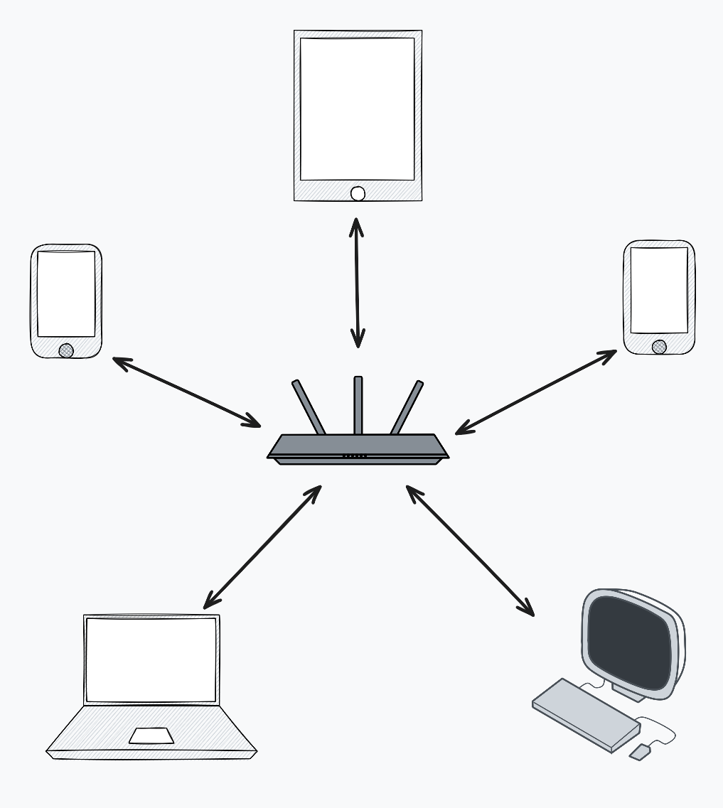
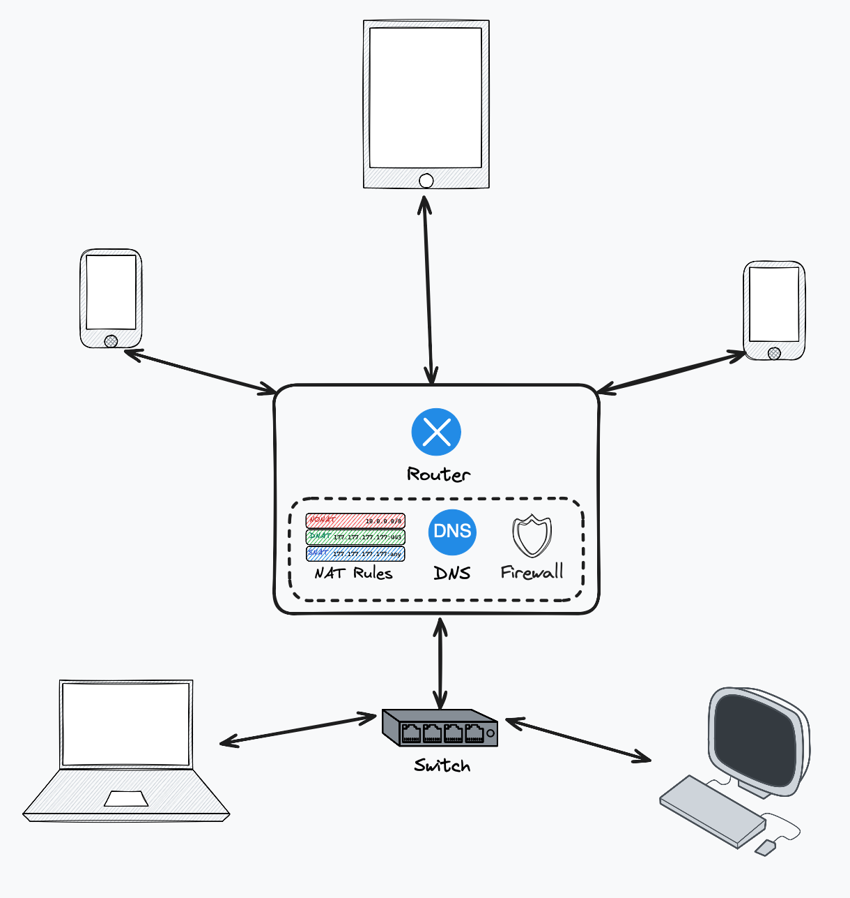

# Introduction to Advanced Networking
In this coursework, we will explore the different elements that make up a modern computer network and guide you through building and configuring your very own network.

Think about your home network: you’ve got a Wi-Fi modem or router that connects your laptop, phone, TV, and maybe even your fridge (because why not) to the internet ([Figure 1](#home-topo)).

<!-- [home-topo]: home-topo.png "Typical Home Network Topology" -->

But have you ever wondered:
- How does your modem know which data belongs to which device?
- How does it forward your Netflix traffic to the internet while sending a Zoom call to your laptop at the same time?
- What magic is happening inside that little plastic box with too many blinking lights?
    
Well… quite a lot!
Your Wi-Fi modem is doing multiple jobs at once, such as:
- Routing: deciding where packets should go
- Switching: connecting devices inside your home network
- Network Address Translation (NAT): letting many devices share one public IP
- DNS Forwarding: helping translate website names into IP addresses
- Firewalling: keeping unwanted traffic out
By the end of this coursework, you’ll understand these components and even configure some of them yourself.

# Tools you will use

This coursework uses a combination of powerful tools designed for learning and experimenting with networks:
- Mininet
    - Used to create virtual network topologies
    - Allows you to instantiate hosts, switches, and links
    - Ideal for testing and experimenting in a contained environment
- P4
    - A protocol-independent language for programming how packets are processed
    - Lets you define custom behaviour inside routers and switches
    - Open-source, high-level, and used widely in software-defined networking research
- Python
    - The interactive language used to script Mininet and P4 interactions
    - Great for automation, controller development, and quickly testing network logic

# Understanding the Functionality of a Home Wi-Fi Modem

As mentioned, a home wifi modem consists of multiple separate components that perform different functions. Most home networks follow a star topology, where multiple devices connect to a central Wi-Fi modem — just like the one shown in [Figure 1](#home-topo).

Although it looks simple from the outside, your home router is quietly multitasking like a networking superhero. It:
- Manages wireless connections
- Acts as a Layer 2 switch for wired devices
- Performs routing between your home network (LAN) and the internet (WAN)
- Runs NAT so all your devices can share one public IP
- Handles DNS forwarding
- Implements firewall rules to protect your network

Understanding these functions gives you a strong foundation before we jump into designing and customizing networks using Mininet and P4.

To gain deeper insight into how each of these components works, we will disaggregate the Wi-Fi modem and examine each function individually. [Figure 2](#home-dis-topo) illustrates the different components and shows how they would be positioned in the network topology once separated.

<!-- [home-dis-topo]: home-dis-topo.png "Disaggregated Home Network Topology" -->

We will begin by exploring Mininet by creating a simple topology with a single switch and using it to understand how a switch operates.

# Task 1: Working with mininet
<!-- How to use mininet -->

## Switch
A switch operates at Layer 2 (the Data Link layer) of the OSI model. Its main role is to connect multiple devices to each other using physical Ethernet links.

Instead of blindly broadcasting data to every device, a switch behaves intelligently. It reads MAC addresses and forwards packets only to the correct destination, improving speed and efficiency.

The MAC layer (also called the Ethernet layer) forms the outermost layer of a network packet within a local network. This is the layer the switch examines to decide where each packet should go.

### 📨 Analogy: The Office Mailroom
Think of a switch like an office mailroom:
- Every employee has a desk number (MAC address)
- The mailroom reads the desk number on each envelope
- Mail is delivered only to the correct desk, not to everyone

This is exactly how a switch ensures packets reach the right device.

# Task 2: Testing the functionality of a switch in Mininet

# Task 3: Building your very own switch with P4!