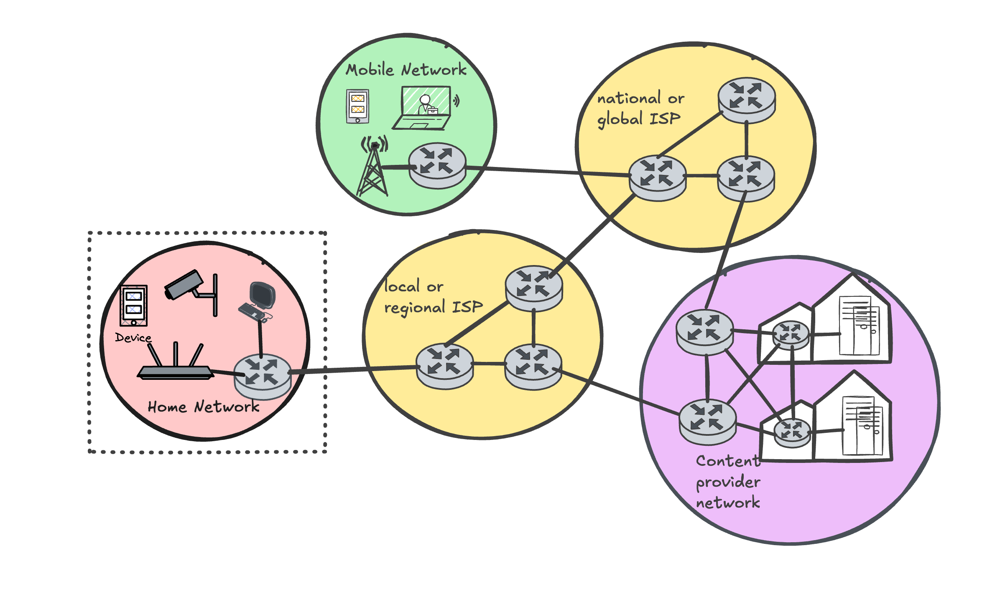
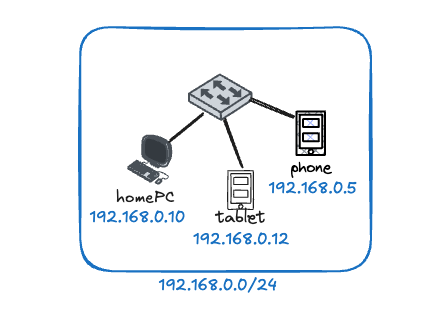
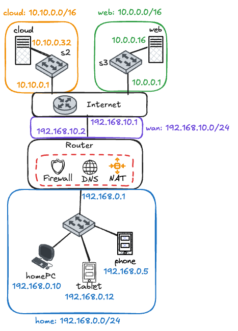

# Introduction to Advanced Networking

In this lab activity, we will explore the different elements that make up a modern computer network and guide you through building and configuring your very own network. Using a simple home network scenario, we will dissect the protocols and functionalities that connect your network devices to the Internet and understand how they interoperate to provide connectivity.

## Lab Overview

Think about your home network: you’ve got a Wi-Fi modem or router that connects your laptop, phone, TV, and maybe even your fridge (because why not) to the Internet ([Figure 1](#home-topo)). This appears to be a very simple network scenario, but it implements several key functionalities essential in delivering connectivity in the highly distributed and complex global Internet. 

<center>
{width="80%" #home-topo}
</center>
<!-- [home-topo]: home-topo.png "Typical Home Network Topology" -->

Have you ever wondered:

- How does your modem know which data belongs to which device?
- How does it forward your Netflix traffic to the internet while sending a Zoom call to your laptop at the same time?
- What magic is happening inside that little plastic box with too many blinking lights?

**Well… quite a lot!** Your Wi-Fi modem is doing multiple jobs at once, such as:

- *Routing*: deciding where packets should go
- *Switching*: connecting devices inside your home network
- *Network Address Translation (NAT)*: letting many devices share one public IP
- *DNS Forwarding*: helping translate website names into IP addresses
- *Firewalling*: keeping unwanted traffic out
  
This lab activity will help you recreate these functionalities on a lab machine/VM using a network emulator, understand how these components work, and even configure some of them yourself. For this activity, we will emulate a home network scenario connected to a small set of Internet services. This will remind you of the different protocols used to connect devices to the global Internet and get you up to speed on some of the key technologies we will use this year to explore advanced network topics in the module labs.

By the end of this lab activity, you will be able to:

- [ ] Understand the key components of a home network and their functions
- [ ] Use Mininet to create and experiment with virtual network topologies
- [ ] Capture and analyse network traffic using Wireshark
- [ ] Refresh your knowledge on network protocols and packet structures

### Lab tools

During our labs, we will use a combination of tools designed for recreating, visualising and experimenting with networks:

- [Mininet](https://mininet.org/) is a network emulator that creates a realistic virtual network on a single machine. It uses lightweight virtualisation to run multiple hosts, switches, and links, all within a single Linux host. We will use Mininet to recreate virtual network topologies with real Linux hosts, switches, and links. Mininet is ideal for reproducible network testing and experimentation, using common virtualisation technologies available in the Linux kernel. 
- [P4](https://p4.org/) is the latest generation of open Software Defined Network technologies. It is a protocol-independent language for programming how packets are processed by a network device. With P4, you can define custom behaviours in routers and switches, while network vendors such as Intel and Barefoot provide hardware that can run P4 programs at line rate (Tbps data processing rates). We will explore this technology in more detail in the Week 12 lecture and labs.
- [Wireshark](https://www.wireshark.org/) is a network protocol analyser that lets you capture and inspect packets in real-time. It provides a graphical interface for viewing packet details, filtering traffic, and analysing network protocols. We will use Wireshark to inspect the traffic flowing through our emulated networks and understand how protocols work under the hood.
- [Python](https://www.python.org/) will be used to script Mininet topologies and to implement custom P4 control logic. You should be familiar with basic Python programming concepts, such as those in modules like SCC.231.  We will use Python scripts to automate network configurations and experiments. If you want to refresh your Python skills, consider checking out resources like [Future Coder](https://futurecoder.io/).

## Task 0: Opening the Dev Container

Working with network protocols on a host requires extensive configuration and tuning of the host operating system. We also need to run code as root, which is a major security threat and requires careful handling. To make your life easier, we use container technology to package everything you need to run our lab activities in a preconfigured environment. You might have heard of Docker containers, which are lightweight, portable, and consistent virtual instances that can run applications and services.

In order to open the code in a devcontainer, you should select the option `Open In devcontainer` when opening the folder in VSCode. If you missed the option when opening the project, you can still set up the devcontainer. Use the key combination of Ctrl+Shift+P to open the command palette and then select **Dev Containers: Open Folder in Container...**. Both options are depicted in the screenshots below.

<center>
{width="80%"}
</center>

<center>
{width="80%"}
</center>
If you have opened the devcontainer correctly, you should see the following prompt when opening a new terminal in VSCode:

<center>
{width="80%"}
</center>

## Understanding the Functionality of a Home Wi-Fi Modem

As mentioned, a home network consists of multiple separate components that perform different functions. Most home networks follow a star topology, where multiple devices connect to a central Wi-Fi modem — just like the one shown in [Figure 1](#home-topo).

Although it looks simple from the outside, your home router is quietly multitasking, like a networking superhero. It:

- Manages wireless connections
- Acts as a Layer 2 switch for wired devices
- Performs routing between your home network (LAN) and the internet (WAN)
- Runs NAT so all your devices can share one public IP
- Handles DNS forwarding
- Implements firewall rules to protect your network

Understanding these functions gives you a strong foundation before we jump into designing and customising networks using Mininet and P4.

To gain deeper insight into how each component works, we will disassemble the Wi-Fi modem and examine each function individually. [Figure 5](#home-dis-topo) illustrates the different components and shows how they would be positioned in the network topology once separated.

{width="80%" #home-dis-topo}
<!-- [home-dis-topo]: home-dis-topo.png "Disaggregated Home Network Topology" -->

Before we discuss how to use Mininet, let's first refresh the concept of layering in computer networks. Computer network technologies, to manage complexity and scalability, adopt layering and abstraction to separate different functionalities into **layers**. Each layer is responsible for specific tasks; it provides services to the layer above and relies on the services of the layer below. This separation allows for easier design, implementation, and troubleshooting of network protocols and devices.

The TCP/IP model, the main Internet protocol stack, considers five network layers:

1. *Physical Layer*: This layer deals with the physical transmission of data over a medium, such as cables or wireless signals. It defines the electrical and mechanical aspects of data transmission (e.g. how do you represent a single bit using an electric current).
2. *Data Link Layer*: This layer is responsible for node-to-node data transfer and error detection/correction. The functionalities include framing, forwarding and addressing (using MAC addresses). The data link layer ensures that two nodes on the same network can communicate effectively, and Ethernet is a common protocol used at this layer.
3. *Network Layer*: This layer handles the routing of data packets across different networks. It determines the best path for data to travel from the source to the destination. It uses logical addressing (IP addresses) to identify devices on the network, and protocols like IP (Internet Protocol) operate at this layer. 
4. *Transport Layer*: This layer provides end-to-end communication control, ensuring complete data transfer. It manages error recovery, flow control, and data segmentation. The transport layer operates between two end systems (hosts) and does not involve intermediate devices such as routers or switches. Common protocols at this layer include TCP (Transmission Control Protocol) and UDP (User Datagram Protocol).
5. *Application Layer*: This layer provides network services directly to user applications. It includes protocols for email, file transfer, and other network software services.

We will begin by exploring Mininet, creating a simple topology with a single switch to understand how a switch operates.

## Task 1: Working with Mininet

<!-- How to use mininet -->
> **NOTE**: Run the command `xhost +` in a terminal on your lab machine (i.e., *not* in the devcontainer or a host in the mininet topology, a terminal on the actual lab machine) before starting Wireshark or xterm in the devcontainer. This command allows GUI applications running inside the devcontainer to be displayed on your host machine.

Mininet is a powerful network emulator that allows you to create and test virtual network topologies on a single machine. It uses lightweight virtualisation to run multiple hosts, switches, and links, all within a single Linux host. This makes it an ideal tool for learning about networking concepts, testing network applications, and experimenting with network protocols. Each host behaves like a real machine, capable of running network programs (web servers, ping, iperf, SSH), with its own network addresses and interfaces.

### How Do We Use Mininet to Reproduce the Functionality of a Switch?

In this part of the lab activity, we will focus on the highlighted component of the home Wi-Fi modem topology discussed earlier — the switch.  With mininet, we can reproduce this in two ways: using the command line or using Python scripts. We will explore both one at a time.  Mininet allows us to recreate real network behaviour in software, making it the perfect tool for experimenting without needing physical hardware. Using Mininet, we can build a simple network where multiple hosts are connected to a switch and observe how packets are forwarded between them.

There are two main ways to create this topology in Mininet:

- Using the Mininet Command Line Interface (CLI)
  - Quick and easy
  - Limited set of topologies
  - Great for learning, testing, and experimenting
- Using Python Scripts
  - More flexible and powerful
  - Allows automation and repeatable experiments
  - Commonly used for larger or more complex topologies

{width="80%"}


We will explore both approaches step by step, starting with the command line and then moving on to Python scripting. This will help you understand not only how a switch works, but also how Mininet represents and manages network devices behind the scenes.
By the end of this section, you’ll be comfortable creating a basic switch-based topology and observing how data flows through it — just like in a real network.

### Mininet CLI

Let's load a simple Mininet topology into our devcontainer environment, consisting of two hosts connected to a single switch. Open a terminal in the devcontainer and run the following command in the VSCode terminal. The command executes Mininet, creates the topology and gives you access to the Mininet terminal from which you can run multiple commands.

```bash
mn --topo single,2 --link tc --mac --switch lxbr --controller none --arp
```

{width="90%"}

Once the topology is created, you should see the Mininet prompt:

```bash
mininet >
```

You can enter commands at this prompt to interact with the Mininet environment. The Mininet prompt offers a few simple commands to inspect the topology of your experiment. Try to run the following commands to inspect the network:

```
mininet> nodes
mininet> net
mininet> dump
```

The `nodes` command lists all the nodes (hosts and switches) in the topology. The `net` command shows the connections between nodes, and the `dump` command provides detailed information about each node, including its IP and MAC addresses.

You can also run commands on individual hosts by prefixing the command with the host name. For example, to test connectivity between the two hosts, you can use the `ping` command:

```
mininet> h1 ping -c 3 h2
```

The previous command will execute the program ping on host h1, send 3 ICMP echo requests to host `h2` and display the round-trip time (RTT) for each packet.

```
mininet > xterm h1 h2
```

{width="80%"}

Each host in the network will have a set of network interfaces and a network configuration, consisting of unique IP and MAC addresses for each interface. A network interface is important for a host to connect to the network. In our example, host `h1` will have a single interface (`h1-eth0`). You can also inspect the interfaces of each host, using the built-in Linux network configuration tools. For example, you can use the iproute2 tool called `ip`. The program allows inspection of the addresses assigned to each interface (`ip addr show`), the IP routes (`ip route show`) and the interfaces (`ip dev show`). By running the commands `h1 ip addr show` and `h2 ip addr show`, you should see that each host has a single interface (eth0) with a unique IP address. You can also run the command `ip addr show`, in the xterm terminal you create in the previous step on each host.

> **TODO**: Using the created topology, answer the questions in the [Week1 Unassessed Quiz](https://modules.lancaster.ac.uk/mod/quiz/view.php?id=2824281).

### Mininet Python Scripting 

Mininet offers a Python API to create topologies. The lab template provides you with a very basic topology file (`./topology.py`) that, through Mininet, will produce an emulated network consisting of 2 host connected via two separate links to a switch ([Figure 8](#topology)). But what exactly does all that mean?

{width="80%" #topology}

<!--  -->

There are 3 fundamental components to a Mininet topology: *Hosts*, *Switches* and *Links*. In later stages, we will discuss additional custom components, such as routers, but for now, we will focus on these 3.

The topology in the lab template code defines a custom class that extends the `Topo` class in Mininet. This class contains the logic to create the nodes and links that make up the topology. The documentation for the `Topo` class can be found [here](http://mininet.org/api/classmininet_1_1topo_1_1Topo.html), and it allows adding each of these components via the `addHost`, `addSwitch` and `addLink` methods. We will discuss these methods in more detail in Stage 4, and we will use them to implement custom topologies.


| **Method**                                                                          | **Description**                                                                                                                                                                                                                                                                                                                                                                                                                                                              |
| ----------------------------------------------------------------------------------- | ---------------------------------------------------------------------------------------------------------------------------------------------------------------------------------------------------------------------------------------------------------------------------------------------------------------------------------------------------------------------------------------------------------------------------------------------------------------------------- |
| `addHost(name, ip=None, default=None, **opts)`                                      | Adds a host to the topology with the given name. You can optionally set an IP address for the first interface, define a default route for the host, and control other options.                                                                                                                                                                                                                                                                                        |
| `addSwitch(name, **opts)`                                                           | Adds a switch to the topology with the given name and options. Mininet supports a range of switch types, including Open vSwitch, Linux Bridge, and user-space switches, which can be specified via options. For this lab, we will use the Linux Bridge switch (`lxbr`) and replace the switch class with a P4 switch in later activities.                                                                                                                   |
| `addLink(node1, node2, intf1=None, intf2=None, params1=None, params2=None, **opts)` | Adds a link between two nodes (hosts or switches) with the given options. The param1 and param2 options accept a dictionary containing configuration for the interfaces created in each host to support the link. For example, the dictionary params1={'ip': '10.20.0.5/24', 'mac': '00:00:00:00:00:01'} will set the interface IP address to 10.20.0.5 and the MAC address to 00:00:00:00:00:01 for node1. The intf1 and intf2 variables define the interface names. |
|                                                                                     |

As you might have guessed, the provided topology file generates the same topology as the one created by the command `mn --topo single,2 --mac --switch lxbr --controller none`. To run the provided topology, execute the following command in a terminal:

```bash
mn --custom ./topology.py --link tc --topo simple --mac --switch lxbr --controller none --arp
```

This command tells Mininet to use the custom topology defined in `topology.py` and to create a network with the specified parameters. Once the topology is created, you should see the Mininet prompt again. You can use the same commands as before to inspect the network and test connectivity between the hosts.

> Hint: Since the mn command is quite long, we have created a Makefile to simplify running the topology. Make is an automation tool that can execute commands defined in a file called `Makefile`. To run the provided topology using the Makefile, simply execute the command `make topo` in a terminal within the devcontainer. This will run the same mn command as above. If you encounter any issues, we also provide a `make clean` command to remove Mininet state from previous runs.

{width="80%"}

> **Your task**: Modify the provided topology file to recreate the topology in Figure 9. Your topology file should define all the necessary hosts with the correct names and IP addresses, connected to the switch via separate links. Once you complete your code, run the modified topology using the `mn --custom` command above and answer the questions in the second part of the [Week1 Unassessed Quiz](https://modules.lancaster.ac.uk/mod/quiz/view.php?id=2824281).

## Task 2: Inspecting Traffic with Wireshark and Mininet

Computer networks are packet-oriented, *i.e.* data is sent across the network in small chunks called packets. You can imagine a packet as a small, self-contained parcel carrying information across the vast landscape of the Internet.

Unlike circuit-switched technologies, e.g. telephone networks, where a continuous stream of data is transmitted, the Internet relies on a concept known as packet switching. In this paradigm, large volumes of data are broken down into manageable pieces or "packets" before being sent across the network. Each packet, akin to an organised postcard, contains the actual data and essential information such as the source and destination addresses (i.e., IP addresses).

As these packets traverse the network, they take different paths to reach their destinations. This dynamic approach enhances efficiency and robustness, as multiple packets can travel concurrently without relying on a fixed path. Upon reaching their destination, the packets are reassembled to reconstruct the original message or data.

### How can you view incoming and outgoing packets on your computer?

A **packet sniffer** is a basic tool for observing incoming and outgoing packets by capturing ("sniffs") messages sent and received by your computer; it typically parses, stores, and displays the contents of the various protocol fields in these captured messages. A packet sniffer is passive: it observes messages being sent and received by applications and protocols running on your computer but never sends packets.  Similarly, received packets are never explicitly addressed to the packet sniffer. Instead, a packet sniffer gets a *copy* of packets sent or received from/by application and protocols executing on your machine.

[Figure 10](#packet-sniffer) shows the structure of a packet sniffer. At the right of Figure 10 are the protocols (in this case, Internet protocols) and applications (such as a web browser or email client) that usually run on your computer. The packet sniffer, shown within the dashed rectangle in Figure 10, is an addition to the usual software in your computer and consists of two parts:

{width="80%" #packet-sniffer}

* The **packet capture library** receives a copy of every packet that is sent from or received by your computer over a given interface (e.g., Ethernet card or Wi-Fi). As discussed above, messages exchanged by protocols such as HTTP are eventually encapsulated in packets that are transmitted over physical media such as an Ethernet cable or a Wi-Fi radio. Capturing the packets thus gives you all the messages sent/received from/by all the applications executing on your computer.

* The second component of a packet sniffer is the **packet analyser**, which displays the contents of all fields within a protocol message.  To do so, the packet analyser must "understand" the structure of all messages exchanged by protocols. For example, suppose we are interested in displaying the various fields in messages exchanged by the HTTP protocol in [Figure 10](#packet-sniffer). The packet analyser understands the format of Ethernet frames and can identify the IP datagram within an Ethernet frame. It also understands the IP datagram format, so that it can extract the TCP segment within the IP datagram.

Finally, it understands the TCP segment structure, so it can extract the HTTP message contained in the TCP segment. Finally, it understands the HTTP protocol and so, for example, knows that the first bytes of an HTTP message will contain the string "GET," "POST," or "HEAD," as shown later in Figure 5 below.

In 333 labs, we will use the [Wireshark packet sniffer](http://www.wireshark.org/)  to display the contents of messages being sent/received from/by protocols at different levels of the protocol stack. (Technically speaking, Wireshark is a packet analyser that uses a packet capture library on your computer).

Also, technically speaking, Wireshark captures link-layer frames as shown in Figure 1, but uses the generic term "packet" to refer to link-layer frames, network-layer datagrams, transport-layer segments, and application-layer messages, so we'll use the less-precise "packet" term here to go along with Wireshark convention). Wireshark is a free network protocol analyser that runs on Windows, Mac, and Linux/Unix computers. 
  
To run Wireshark on a host in your Mininet topology, you first must use the `xterm` command from the Mininet CLI to open a terminal window for the host, and then run Wireshark from that terminal. Start a wireshark application on host `homePC` and start sniffing packets on interface `homePC-eth0` (the only interface of host `homePC`), by clicking on the interface name in the list of available interfaces. You should start seeing packets being captured in real-time (predominantly you will observer ICMPv6 packets). Congratulations, you are now capturing packets on a host in your Mininet topology!

Let now generate some traffic between the two hosts in your topology. From the Mininet CLI, run the command `homePC ping -c 5 tablet` to send 5 ICMP echo requests from host `homePC` to host `tablet`. You should see the corresponding ICMP packets appearing in Wireshark on host `homePC`. You can stop the packet capture in Wireshark by clicking on the red square button in the toolbar. The main Wireshark window should now display all the captured packets, along with details such as the source and destination IP addresses, protocol type, and packet length, by selecting individual packets. The captured packets should contain multiple protocol headers, as a result of network layers (typically, Ethernet -> IPv4 -> UDP/TCP).

> **Your task**: By inspecting the captured packets, answer the questions in the third part of the [Week1 Unassessed Quiz](https://modules.lancaster.ac.uk/mod/quiz/view.php?id=2824281).

## Task 3: Understanding Ethernet and Switching

Ethernet is the most widely used technology for local area networks (LANs). It defines a set of standards for wiring and signaling at the physical layer, as well as data link layer protocols for framing and addressing. Ethernet uses MAC (Media Access Control) addresses to uniquely identify devices on a network. The Ethernet header is the first part of every network packet and contains important information for delivering the packet to its destination within a local network. It typically contains an address of the sender and the receiver of the packet, as well as a type field that indicates the protocol of the payload (e.g., IPv4, IPv6, ARP).

In order to connect multiple devices within a local network, Ethernet requires special devices that can multiplex traffic between several cables. Originally, network hubs were the first attempt to achieve this. Hubs rebroadcast traffic received on an Ethernet cable, to all cables connected to the device. Because hubs blindly retransmit traffic, they are inefficient and insecure as they blindly broadcasted incoming packets to all connected devices. To improve efficiency and performance, Ethernet switches were introduced. Instead of blindly broadcasting data to every device, a switch uses an algorithm to learn the MAC addresses of devices connected to each port. It reads MAC addresses and forwards packets only to the correct destination, improving speed and efficiency.

#### 📨 Analogy: The Office Mailroom

Think of a switch like an office mailroom:

- Every employee has a desk number (MAC address)
- The mailroom reads the desk number on each envelope
- Mail is delivered only to the correct desk, not to everyone

This is exactly how a switch ensures packets reach the right device.

A learning switch operates by maintaining a MAC address table that maps MAC addresses to specific switch ports. When a frame arrives at the switch, it examines the source MAC address and records which port it came from in its MAC address table. This way, the switch learns where each device is located on the network. Furthermore, the switch looks at the destination MAC address of the incoming frame. If the destination MAC address is found in the MAC address table, the switch forwards the frame only to the port associated with that MAC address. If the destination MAC address is not found in the table, the switch floods the frame out of all ports except the one it arrived on, ensuring that it reaches its intended recipient.


Linux uses the term *bridge* to describe a software-based switch. In Mininet, when we create a switch using the `lxbr` switch type, we are essentially creating a Linux bridge that functions as a learning switch. The Linux bridge will learn MAC addresses and forward frames in the same way as a physical Ethernet switch.

In order to inspect the MAC table of a Linux bridge, you can use the `bridge` CLI tool. For example, to view the MAC address table of a switch named `s1`, you can run the following command in the Mininet prompt `s1 bridge fdb show br s1`. You can also flush the MAC address table using the command `s1 bridge fdb flush br s1`.

### Verifying Switch Functionality with Wireshark

Let's now open a Wireshark instance on host `h2` and start capturing packets on interface `h2-eth0`. Once Wireshark is running, go back to the Mininet CLI and run the command `h1 ping -c 5 h2` to send 5 ICMP echo requests from host `h1` to host `h2`. You should not see the corresponding ICMP packets appearing in Wireshark on host `h2`. This happens because the switch has learned the MAC addresses of both hosts and is forwarding packets only to the correct destination. Run now on the Mininet terminal the command `s1 bridge fdb flush br s1` and repeat the ping command from `h1` to `h2`. This time, you should see **one** ICMP packets appearing in Wireshark on host `h2`, as the switch has flushed its MAC address table and is flooding the packets to all ports. MAC addresses are relearned by the switch as packets are sent between the hosts. In parallel, a timeout value is associated with each entry in the MAC address table, so that if no packets are received from a device for a certain period of time, the entry is removed from the table.

> **Your task**: Using the provided topology, answer the questions in the fourth part of the [Week1 Unassessed Quiz](https://modules.lancaster.ac.uk/mod/quiz/view.php?id=2824281).

## Task 4: Understanding IPv4 and Routing

In the previous tasks, we explored how devices communicate within a local network using Ethernet and switches. However, to connect to devices outside our local network, such as accessing websites on the Internet, we need to understand how data is routed between different networks. This is where the Internet Protocol (IP) comes into play.

In the global Internet, hosts are grouped into separate networks, each identified by a unique network address. To communicate with hosts in other networks, data packets must be routed through intermediary devices called routers. Routers use IP addresses to determine the best path for forwarding packets to their destination. During the SCC.231 module, you learned about IPv4 addressing and subnetting, which are essential concepts for understanding how routing works, as well as experienced the use of routing protocols such as OSPF and BGP, to dynamically learn and exchange routing information between routers.

### Adding "Internet" services to our Mininet Topology

{width="80%" #homenet-router}

Lets now extend our Mininet topology to include a router and two Internet services, as shown in Figure 12. The router will connect our home network to the Internet services, allowing hosts in the home network to communicate with these services. The two Internet services will be represented by two additional hosts in the Mininet topology, each running a simple web server. You also need to add a couple of new switches (`s2` and `s3`) as well as a new host (`router`) to interconnect the home network with the Internet services. The `router` host will represent the router functionality of the home router, forwarding packets between the home network and the Internet services. You will need to configure IP addresses on all interfaces and set up routing on the `router` host to enable communication between the home network and the Internet services.

In order to support the routing functionality, the provide topology.py file contains a new class called `Router` that extends the `Host` class in Mininet. This class configures IP forwarding on the host, allowing it to forward packets between its interfaces. You can use this class to create the `router` host in your topology. You can create a new `router` host in your topology using the following code snippet:

```python
router = self.addHost('router', ip=None, cls=Router)
```

> Hint: As the home router will have multiple interfaces, you should not assign an IP address when creating the host. we must need to set the `ip` parameter to `None` to prevent Mininet from assigning an IP address to the first interface of the host; you will assign IP addresses to all interfaces manually later using the addLink method and the `params1` or `params2` parameters.

> **Your task**: Modify the provided topology file to recreate the topology in Figure 12. Your topology file should define all the necessary hosts with the correct names and IP addresses, connected to the appropriate switches via separate links. 

Your topology should also configure routing on the individual hosts, so they are aware to send packets destined for the Internet services via the `router` host. You can set the default route for each host using the `default` parameter of the `addHost` method. For example, to set the default route for host `homePC` to point to the router's interface in the home network, you can use the following code snippet:

```python
homePC = self.addHost('homePC', ip='192.168.0.10/24', default='via 192.168.0.1')
```

In Linux, each host maintains a routing table that defines how packets should be forwarded based on their destination IP address. The routing table contains entries that specify the destination network, the next hop (router) to reach that network, and the interface to use for sending the packet. You can view the routing table of a host using the `ip route show` command.

### IPv4 and Routing Refresher

IP addresses are hierarchical, and different operators will typically split the network into sub networks and , consisting of a network portion and a host portion. The network portion identifies the specific network, while the host portion identifies the individual device within that network. This hierarchical structure allows routers to efficiently forward packets based on the destination network. In the provided topology file, there are three network regions, were hosts can reach each other at the data link layer:

* Home Network (192.168.0.0/24): homePC(homePC-eth0), tablet (tablet-eth0), phone (phone-eth0), router (router-eth0)
* Cloud Network (10.10.0.0/16): cloud (cloud-eth0), router(router-eth1)
* Web Network (10.0.0.0/16): web (web-eth0), router (router-eth2)

Hosts in the same network are directly reachable in a region using either switches or direct links. In order though for traffic to travel across networks, we need a device called router. A router operates at the network layer of the TCP/IP protocol stack and forwards traffic between different networks. It is essential for a router to have an IP and an interface connected in every network. In our topology, host `router` must route traffic between the three networks and has already an IP address in each network.

A router typically maintains a routing table that contains information about how to reach different networks. When a router receives a packet, it examines the destination IP address and consults its routing table to determine the best path for forwarding the packet. The router then forwards the packet to the next hop, which could be another router or the final destination host. Also, the router, similar to every network host, maintains an ARP table that maps IP addresses to MAC addresses for devices in each connected network. It is essential for the router to resolve MAC addresses for devices in each network to successfully forward packets at the data link layer. For this functionality, the router will use ARP requests to resolve MAC addresses for devices in each network. In our Mininet topology, we have opted to use an alternative approach by predefining the MAC addresses for each interface in the topology file and creating static entries in the ARP table. For this approach to work, we assume that the topology is fixed and we do not need to dynamically resolve MAC addresses using ARP requests.

IP addresses are 32-bit numbers that uniquely identify devices in a network. They are typically represented in dotted-decimal notation, which consists of four octets (8 bits each) separated by periods. Usually, IP addresses are split into two parts: the network and the host portion. The network  identifies the network to which the IP address belongs, while the host portion identifies the specific device on that network. The length of the network portion is defined by the subnet mask, which is a 32-bit number that specifies how many left-most bits of the IP address belong to the network portion and which bits belong to the host portion. The length of the network portion can also be  represented as an integer. The remaining bits are used for the host portion.

For example, the IP address 192.168.1.1/24 has a subnet 255.255.255.0 (i.e., the 24 left-most bits are set to 1 and the rest is zero) and its network portion is 192.168.1.0/24. It is in the same network as 192.168.1.2/24 and 192.168.1.3/24, but not in the same network as 192.168.2.1/24, which has a network portion of 192.168.2.0/24. Similarly, the subnet mask 10.0.0.0/24 has a 24 bit network prefix length and the network contains the IP addresses from 10.0.0.1-10.0.0.254 ($2^8-2$) (typically the first and last address of a network range cannot be used as addresses for individual hosts). Similarly, the subnet mask 10.1.0.0/16 defines the IP addresses from 10.1.0.1-10.1.255.154 ($2^{16} -2$) as belonging to the same network.

The routing table of each host contains entries that define how packets should be forwarded based on their destination IP address. Each entry in the routing table typically consists of the following fields:

* Destination Network: The network address of the destination network.
* Subnet Mask: The subnet mask that defines the size of the destination network.
* Next Hop: The IP address of the next hop (router) to reach the destination network.
* Interface: The network interface to use for sending the packet.

You can inspect your routing table on each host in your Mininet topology using the `ip route show` command. For example, to view the routing table of host `homePC`, you can run the following command in the Mininet prompt:

```bash
mininet> homePC ip route show
```

> **Your task**: One you complete your updated Mininet topology, run the modified topology using the `mn --custom` command above and answer the questions in the fifth part of the [Week1 Unassessed Quiz](https://modules.lancaster.ac.uk/mod/quiz/view.php?id=2824281).

## Task 5: Understanding NAT on the Router

In the previous task, we extended our Mininet topology to include a router and two Internet services. The router allowed hosts in the home network to communicate with these services by forwarding packets between different networks. However, in a real-world scenario, home networks typically use private IP addresses that are not routable on the public Internet. To enable communication between devices in a private network and the public Internet, we need to implement Network Address Translation (NAT) on the router.

NAT is a technique that allows multiple devices in a private network to share a single public IP address when accessing the Internet. It works by modifying the source IP address and port number of outgoing packets from devices in the private network to the public IP address and a unique port number assigned by the router. When the response packets return from the Internet, the router translates the destination IP address and port number back to the original private IP address and port number of the device that initiated the request.

The Linux OS provides built-in support for NAT through the use of iptables, a powerful firewall and packet filtering tool. To enable NAT on the router host in our Mininet topology, we need to configure iptables to perform source NAT (SNAT) for outgoing packets from the home network to the Internet services.

You can enable NAT on the router host by running the following commands in the Mininet CLI:

```bash
mininet> router iptables -t nat -A POSTROUTING -o router-eth1 -j MASQUERADE
mininet> router iptables -t nat -A POSTROUTING -o router-eth2 -j MASQUERADE
```

These commands add rules to the NAT table in iptables that specify that outgoing packets on interfaces `router-eth1` and `router-eth2` should have their source IP address modified to the IP address of the respective interface (i.e., perform source NAT). The `MASQUERADE` target is used to automatically determine the appropriate source IP address based on the outgoing interface.

> **Your task**: After enabling NAT on the router, test connectivity from the home network hosts to the Internet networks, answer the questions in the final part of the [Week1 Unassessed Quiz](https://modules.lancaster.ac.uk/mod/quiz/view.php?id=2824281).
